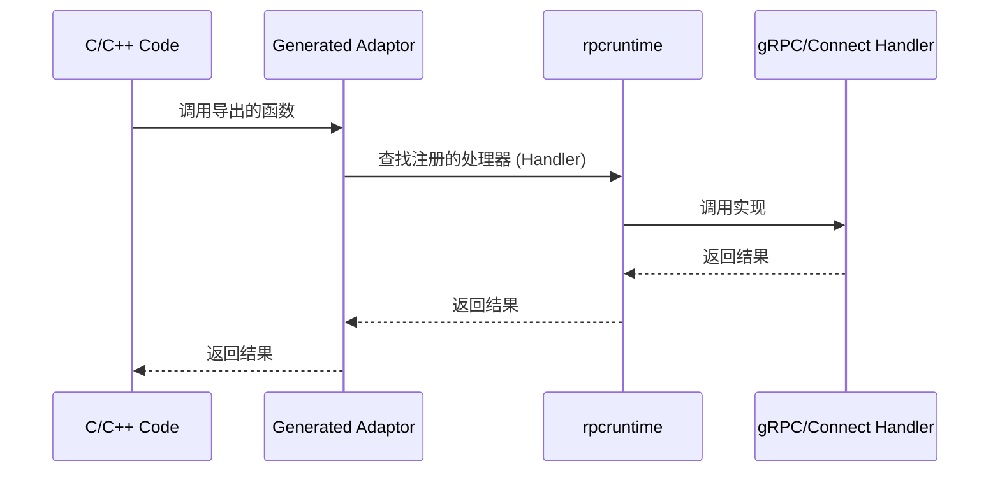

# rpccgo

像写 RPC 一样编写 CGO — 在没有网络开销的情况下，将 C/C++ 桥接到 Go gRPC/Connect 服务。



## 快速开始 (Quick Start)

### 1. 安装插件 (Install the Plugin)

```bash
go install github.com/ygrpc/rpccgo/cmd/protoc-gen-rpc-cgo-adaptor@latest
```

### 2. 生成适配器代码 (Generate Adaptor Code)

```bash
# 使用默认协议 (ConnectRPC) 生成适配器
protoc -I. --rpc-cgo-adaptor_out=./output \
  --rpc-cgo-adaptor_opt=paths=source_relative \
  your_service.proto

# 仅为 gRPC 生成适配器
protoc -I. --rpc-cgo-adaptor_out=./output \
  --rpc-cgo-adaptor_opt=paths=source_relative,protocol=grpc \
  your_service.proto

# 生成支持 gRPC 和 ConnectRPC 的适配器 (带有回退顺序)
protoc -I. --rpc-cgo-adaptor_out=./output \
  --rpc-cgo-adaptor_opt=paths=source_relative,protocol=grpc|connectrpc \
  your_service.proto
```

### 3. 注册你的处理器 (Register Your Handler)

```go
import "github.com/ygrpc/rpccgo/rpcruntime"

// 对于 gRPC 处理器
handler := &MyTestServiceServer{}
rpcruntime.RegisterGrpcHandler("your.package.TestService", handler)

// 对于 Connect 处理器 (Simple API 模式)
handler := &MyTestServiceHandler{}
rpcruntime.RegisterConnectHandler("your.package.TestService", handler)
```

### 4. 通过生成的适配器进行调用 (Call via Generated Adaptor)

```go
ctx := context.Background()
resp, err := TestService_Ping(ctx, &PingRequest{Message: "hello"})
```

---

## 插件选项 (Plugin Options)

| 选项 | 取值 | 描述 |
|--------|--------|-------------|
| `protocol` | `grpc`, `connectrpc`, `grpc\|connectrpc` | 要支持的协议。使用 `\|` 分隔符指定多个协议 (回退顺序)。默认值：`connectrpc` |
| `connect_package_suffix` | 例如 `connect` | connect-go 生成包的后缀。设置后，处理器接口将从 `<import-path>/<go-package-name><suffix>` 导入 |
| `paths` | `source_relative`, `import` | 输出路径模式 |

> **注意**：Connect 框架仅支持 **Simple API 模式** (使用 `protoc-gen-connect-go` 且开启 `simple=true` 选项)。

---

## 协议选择 (Protocol Selection)

### 单协议模式 (Single-Protocol Mode)

当仅配置一种协议时，适配器将排他地使用该协议：

```bash
# 仅 gRPC
protoc --rpc-cgo-adaptor_opt=protocol=grpc ...

# 仅 ConnectRPC (默认)
protoc --rpc-cgo-adaptor_opt=protocol=connectrpc ...
```

### 带回退机制的多协议模式 (Multi-Protocol Mode with Fallback)

当配置了多种协议 (例如 `protocol=grpc|connectrpc`) 时，适配器支持自动回退：

```go
// 不带显式协议：按配置顺序尝试协议
ctx := context.Background()
resp, err := TestService_Ping(ctx, req)  // 先尝试 gRPC，失败则尝试 ConnectRPC

// 带有显式协议：仅尝试该协议 (不回退)
ctx := rpcruntime.WithProtocol(context.Background(), rpcruntime.ProtocolGrpc)
resp, err := TestService_Ping(ctx, req)  // 仅尝试 gRPC
```

### 协议上下文 API (Protocol Context API)

```go
import "github.com/ygrpc/rpccgo/rpcruntime"

// 在 context 中设置协议
ctx := rpcruntime.WithProtocol(ctx, rpcruntime.ProtocolGrpc)
ctx := rpcruntime.WithProtocol(ctx, rpcruntime.ProtocolConnectRPC)

// 从 context 中读取协议
protocol, ok := rpcruntime.ProtocolFromContext(ctx)
if ok {
    fmt.Println("Protocol:", protocol)  // "grpc" 或 "connectrpc"
}
```

### 协议常量 (Protocol Constants)

```go
const (
    ProtocolGrpc      Protocol = "grpc"
    ProtocolConnectRPC Protocol = "connectrpc"
)
```

---

## 处理器注册 API (Handler Registration API)

### 注册处理器 (Register Handlers)

```go
import "github.com/ygrpc/rpccgo/rpcruntime"

// 注册 gRPC 处理器
replaced, err := rpcruntime.RegisterGrpcHandler("your.package.TestService", handler)

// 注册 Connect 处理器
replaced, err := rpcruntime.RegisterConnectHandler("your.package.TestService", handler)
```

- `replaced`: 如果替换了现有处理器则为 `true`
- `err`: 如果注册失败 (例如处理器为 nil) 则非 nil

### 查找处理器 (Lookup Handlers)

```go
handler, ok := rpcruntime.LookupGrpcHandler("your.package.TestService")
handler, ok := rpcruntime.LookupConnectHandler("your.package.TestService")
```

### 列出已注册的服务 (List Registered Services)

```go
grpcServices := rpcruntime.ListGrpcServices()       // []string
connectServices := rpcruntime.ListConnectServices() // []string
```

---

## 流式 RPC (Streaming RPC)

### 客户端流式 (Client-Streaming)

分阶段 API: `Start` → `Send` (多次) → `Finish`

```go
ctx := context.Background()

// 1. 开启流
handle, err := TestService_ClientStreamCallStart(ctx)
if err != nil {
    return err
}

// 2. 发送消息
err = TestService_ClientStreamCallSend(handle, &StreamRequest{Data: "msg1"})
err = TestService_ClientStreamCallSend(handle, &StreamRequest{Data: "msg2"})

// 3. 完成并获取响应
resp, err := TestService_ClientStreamCallFinish(handle)
```

### 服务端流式 (Server-Streaming)

带有 `onRead` 和 `onDone` 的回调 API：

```go
ctx := context.Background()

err := TestService_ServerStreamCall(ctx, req,
    func(resp *StreamResponse) bool {
        fmt.Println("Received:", resp.GetResult())
        return true  // 返回 false 以停止接收
    },
    func(err error) {
        if err != nil {
            fmt.Println("Stream error:", err)
        } else {
            fmt.Println("Stream completed")
        }
    },
)
```

### 双向流式 (Bidirectional Streaming)

结合了分阶段 API 和回调：

```go
ctx := context.Background()

// 1. 开启并设置接收回调
handle, err := TestService_BidiStreamCallStart(ctx,
    func(resp *StreamResponse) bool {
        fmt.Println("Received:", resp.GetResult())
        return true
    },
    func(err error) {
        fmt.Println("Receive completed:", err)
    },
)
if err != nil {
    return err
}

// 2. 发送消息
TestService_BidiStreamCallSend(handle, &StreamRequest{Data: "msg1"})
TestService_BidiStreamCallSend(handle, &StreamRequest{Data: "msg2"})

// 3. 关闭发送侧
TestService_BidiStreamCallCloseSend(handle)
```

---

## 错误注册表 (Error Registry - 运行时功能)

对于跨语言 FFI 场景，运行时提供了一个错误注册表，以便安全地跨越 CGO 边界传递错误消息。

### 为什么？ (Why?)

- 直接返回 Go 字符串指针是不安全的 (涉及 GC、生命周期、跨线程等问题)
- 注册表提供了一个两步模型：存储错误 → 通过 ID 检索

### Go API

```go
import "github.com/ygrpc/rpccgo/rpcruntime"

// 存储错误，获取 ID (如果错误为 nil 则返回 0)
id := rpcruntime.StoreError(err)

// 将任意字节存储为错误消息
id := rpcruntime.StoreErrorMsg([]byte("custom error message"))

// 通过 ID 检索错误消息
msg, found := rpcruntime.GetErrorMsgBytes(id)
```

### TTL 与清理 (TTL & Cleanup)

- 错误记录保留约 **3 秒**
- 读取过期的记录将返回 `not-found`
- 后台 goroutine 会定期清理过期条目

### C ABI: `Ygrpc_GetErrorMsg`

```c
typedef void (*FreeFunc)(void*);

// 如果找到返回 0，如果未找到/已过期返回 1
int Ygrpc_GetErrorMsg(int error_id, void** msg_ptr, int* msg_len, FreeFunc* msg_free);
```

**使用方法**:
1. 调用适配器函数，失败时获取 `errorId`
2. 调用 `Ygrpc_GetErrorMsg(errorId, &ptr, &len, &freeFn)` 检索消息
3. 使用消息，然后调用 `freeFn(ptr)` 释放内存

---

## 调度错误 (Dispatch Errors)

运行时定义了用于调度失败的标准错误：

```go
var (
    ErrServiceNotRegistered = errors.New("rpcruntime: service not registered")
    ErrHandlerTypeMismatch  = errors.New("rpcruntime: handler does not implement required interface")
    ErrUnknownProtocol      = errors.New("rpcruntime: unknown protocol in context")
)
```

---

## 架构 (Architecture)

```
┌─────────────────────────────────────────────────────────────┐
│                        C/C++ 代码                           │
└─────────────────────────────────────────────────────────────┘
                              │
                              ▼
┌─────────────────────────────────────────────────────────────┐
│              生成的适配器 (*_cgo_adaptor.go)                │
│  - C-ABI 友好的函数签名                                     │
│  - 协议选择与处理器查找                                     │
│  - 流式会话管理                                             │
└─────────────────────────────────────────────────────────────┘
                              │
                              ▼
┌─────────────────────────────────────────────────────────────┐
│                     rpcruntime 包                           │
│  ┌──────────────────┐  ┌──────────────────┐                │
│  │  处理器注册表    │  │  错误注册表      │                │
│  │  (dispatch.go)    │  │  (errors.go)     │                │
│  └──────────────────┘  └──────────────────┘                │
│  ┌──────────────────┐  ┌──────────────────┐                │
│  │ 协议上下文       │  │  流句柄 (Stream) │                │
│  │ (protocol_ctx.go)│  │ (stream_handle)  │                │
│  └──────────────────┘  └──────────────────┘                │
└─────────────────────────────────────────────────────────────┘
                              │
                              ▼
┌─────────────────────────────────────────────────────────────┐
│              你的 gRPC/Connect 处理器实现                   │
└─────────────────────────────────────────────────────────────┘
```

---

## 完整示例 (Complete Example)

### Proto 定义 (Proto Definition)

```protobuf
syntax = "proto3";
package example;
option go_package = "github.com/yourorg/example";

service Greeter {
  rpc SayHello(HelloRequest) returns (HelloResponse);
  rpc StreamGreet(stream HelloRequest) returns (HelloResponse);
}

message HelloRequest {
  string name = 1;
}

message HelloResponse {
  string message = 1;
}
```

### 生成代码 (Generate Code)

```bash
# 生成 protobuf & gRPC 代码
protoc -I. \
  --go_out=./gen --go_opt=paths=source_relative \
  --go-grpc_out=./gen --go-grpc_opt=paths=source_relative \
  greeter.proto

# 生成 CGO 适配器
protoc -I. \
  --rpc-cgo-adaptor_out=./gen \
  --rpc-cgo-adaptor_opt=paths=source_relative,protocol=grpc \
  greeter.proto
```

### 实现处理器 (Implement Handler)

```go
package example

import "context"

type GreeterServer struct{}

func (s *GreeterServer) SayHello(ctx context.Context, req *HelloRequest) (*HelloResponse, error) {
    return &HelloResponse{Message: "Hello, " + req.GetName()}, nil
}

// StreamGreet 客户端流式实现
func (s *GreeterServer) StreamGreet(stream Greeter_StreamGreetServer) error {
    var names []string
    for {
        req, err := stream.Recv()
        if err == io.EOF {
            return stream.SendAndClose(&HelloResponse{
                Message: "Hello, " + strings.Join(names, ", "),
            })
        }
        if err != nil {
            return err
        }
        names = append(names, req.GetName())
    }
}
```

### 注册并使用 (Register and Use)

```go
package main

import (
    "context"
    "fmt"

    "github.com/ygrpc/rpccgo/rpcruntime"
    "github.com/yourorg/example/gen"
)

func main() {
    // 注册处理器
    handler := &example.GreeterServer{}
    rpcruntime.RegisterGrpcHandler("example.Greeter", handler)

    // 通过适配器调用
    ctx := context.Background()
    resp, err := gen.Greeter_SayHello(ctx, &gen.HelloRequest{Name: "World"})
    if err != nil {
        panic(err)
    }
    fmt.Println(resp.GetMessage())  // Hello, World

    // 客户端流式示例
    handle, _ := gen.Greeter_StreamGreetStart(ctx)
    gen.Greeter_StreamGreetSend(handle, &gen.HelloRequest{Name: "Alice"})
    gen.Greeter_StreamGreetSend(handle, &gen.HelloRequest{Name: "Bob"})
    resp, _ = gen.Greeter_StreamGreetFinish(handle)
    fmt.Println(resp.GetMessage())  // Hello, Alice, Bob
}
```
