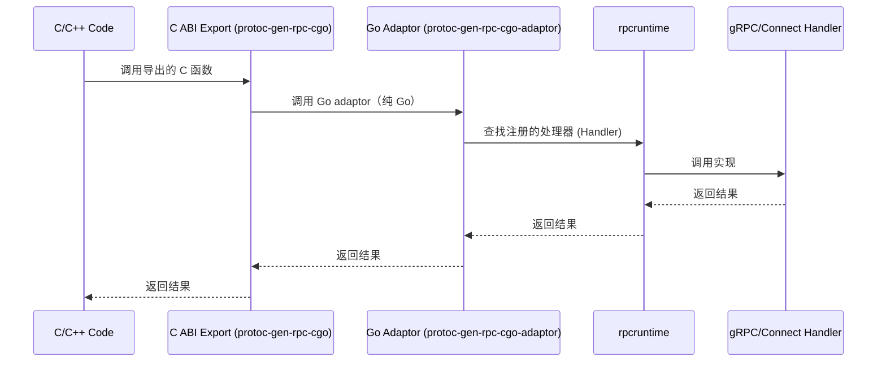

# rpccgo

像写 RPC 一样编写 CGO — 在没有网络开销的情况下，将 C/C++ 桥接到 Go gRPC/Connect 服务。



## 这是什么？(What & Why)

`rpccgo` 解决的是「**让 C/C++（或任何 FFI 调用方）像调用本地函数一样调用 Go 的 gRPC/Connect 服务实现**」的问题：

- **没有网络开销**：不会起端口/走 TCP，只是在同一进程内做分发与调用。
- **面向 RPC 的 API**：仍然以 proto/service/method 为中心，保持与 gRPC/Connect 的编程模型一致。
- **跨语言错误可取回**：通过错误注册表（error id → message）安全跨越 CGO 边界。

### 你会用到的组件

- `rpcruntime`：运行时（处理器注册表、协议选择、流句柄、错误注册表等）。
- `protoc-gen-rpc-cgo-adaptor`：生成 **Go 侧 adaptor**（文件名通常是 `*_cgo_adaptor.go`，但它本身不导出 C ABI；它负责把调用分发到已注册的 handler）。
- `protoc-gen-rpc-cgo`：生成 **C ABI 导出代码**（给 C/C++ 直接链接调用的 `.h/.so`）。

## 快速开始 (Quick Start)

这部分给出两条最常见路径：

1) **仅 Go 侧进程内调用**：生成 pb +（gRPC/Connect）stub + rpccgo adaptor，然后在 Go 里直接调用生成的 `Service_Method(...)`（不涉及 C ABI）。
2) **给 C/C++ 调用**：在 1) 的基础上，再生成 C ABI 导出层（`.h/.so`），由 C/C++ 链接调用。

> 关键概念：`protoc-gen-rpc-cgo-adaptor` 只生成 **Go adaptor**；它不是 C ABI。要让 C/C++ 调用，你还需要 `protoc-gen-rpc-cgo` 生成 **package main + //export** 的导出层，并把它放在独立目录。

### 0. 前置要求 (Prerequisites)

- 已安装 `protoc` 和 Go 工具链
- 你选择的协议需要对应的 Go stub：
    - gRPC：需要 `protoc-gen-go` + `protoc-gen-go-grpc`
    - ConnectRPC：需要 `protoc-gen-go` + `protoc-gen-connect-go`（且必须 `simple=true`）

### 1. 安装所需插件 (Install Plugins)

```bash
go install google.golang.org/protobuf/cmd/protoc-gen-go@latest

# 如果你要用 gRPC：
go install google.golang.org/grpc/cmd/protoc-gen-go-grpc@latest

# 如果你要用 ConnectRPC(仅支持v1.19.0+)：
go install connectrpc.com/connect/cmd/protoc-gen-connect-go@latest

# rpccgo adaptor 生成器（必需）
go install github.com/ygrpc/rpccgo/cmd/protoc-gen-rpc-cgo-adaptor@latest

# 如果你还要生成 C ABI（给 C/C++ 调用）：
go install github.com/ygrpc/rpccgo/cmd/protoc-gen-rpc-cgo@latest
```

### 2. 生成 Go stub + rpccgo adaptor (Generate Go Stubs + Adaptor)

你需要先生成 **pb + 协议 stub**，再生成 **rpccgo adaptor**。推荐像下方示例一样，显式指定 `M<file>.proto=...` 映射，避免目录/包名与 `go_package` 不一致。

下面用 `./proto` 作为 proto 目录，用 `./gen` 作为生成输出目录示意（你可改成自己的目录）。

#### 2.1 gRPC（推荐先跑通这条路径）

```bash
# 例：把 your_service.proto 映射到 example.com/yourmod/gen;yourpb
GO_PKG="Myour_service.proto=example.com/yourmod/gen;yourpb"

# 1) 生成 pb + gRPC stub
protoc -Iproto \
    --go_out=./gen --go_opt=paths=source_relative,${GO_PKG} \
    --go-grpc_out=./gen --go-grpc_opt=paths=source_relative,${GO_PKG} \
    ./proto/your_service.proto

# 2) 生成 rpccgo adaptor（输出到同一个 Go 包目录里）
protoc -Iproto \
    --rpc-cgo-adaptor_out=./gen \
    --rpc-cgo-adaptor_opt=paths=source_relative,protocol=grpc,${GO_PKG} \
    ./proto/your_service.proto
```

#### 2.2 ConnectRPC（需要 Simple API）

```bash
GO_PKG="Myour_service.proto=example.com/yourmod/gen;yourpb"

# 1) 生成 pb
protoc -Iproto \
    --go_out=./gen --go_opt=paths=source_relative,${GO_PKG} \
    ./proto/your_service.proto

# 2) 生成 connect-go stub（必须 simple=true）
protoc -Iproto \
    --connect-go_out=./gen --connect-go_opt=paths=source_relative,${GO_PKG},simple=true \
    ./proto/your_service.proto

# 3) 生成 rpccgo adaptor
protoc -Iproto \
    --rpc-cgo-adaptor_out=./gen \
    --rpc-cgo-adaptor_opt=paths=source_relative,protocol=connectrpc,${GO_PKG} \
    ./proto/your_service.proto
```

#### 2.3 多协议回退（grpc\|connectrpc）

多协议模式要求你把 **两套协议 stub 都生成出来**（gRPC + ConnectRPC），再生成带回退的 adaptor：

```bash
GO_PKG="Myour_service.proto=example.com/yourmod/gen;yourpb"

protoc -Iproto \
    --rpc-cgo-adaptor_out=./gen \
    --rpc-cgo-adaptor_opt=paths=source_relative,protocol=grpc\|connectrpc,${GO_PKG} \
    ./proto/your_service.proto
```

### 3. 注册你的处理器 (Register Your Handler)

```go
import "github.com/ygrpc/rpccgo/rpcruntime"

// 对于 gRPC 处理器
handler := &MyTestServiceServer{}
rpcruntime.RegisterGrpcHandler("your.package.TestService", handler)

// 对于 Connect 处理器 (Simple API 模式)
handler := &MyTestServiceHandler{}
rpcruntime.RegisterConnectHandler("your.package.TestService", handler)
```

### 4. 通过生成的适配器进行调用 (Call via Generated Adaptor)

```go
import pb "example.com/yourmod/gen" // 替换成你的 go_package 对应的导入路径

ctx := context.Background()
resp, err := pb.TestService_Ping(ctx, &pb.PingRequest{Message: "hello"})
```

### 5. （可选）生成 C ABI 导出层给 C/C++ 调用 (Generate C ABI Exports)

`protoc-gen-rpc-cgo` 生成的是 **package main + //export** 的导出代码，必须放在一个独立目录（不要与 `./gen` 这种 pb+adaptor 包混在一起）。

```bash
GO_PKG="Myour_service.proto=example.com/yourmod/gen;yourpb"

protoc -Iproto \
    --rpc-cgo_out=./cgo_export \
    --rpc-cgo_opt=paths=source_relative,${GO_PKG} \
    ./proto/your_service.proto

go build -buildmode=c-shared -o ./libygrpc.so ./cgo_export
```

如果你希望复制粘贴即可跑通一个最小示例，请直接看下方的「可跟随示例」。

---

## 插件选项 (Plugin Options)

### protoc-gen-rpc-cgo-adaptor 选项

| 选项 | 取值 | 描述 |
|--------|--------|-------------|
| `protocol` | `grpc`, `connectrpc`, `grpc\|connectrpc` | 要支持的协议。使用 `\|` 分隔符指定多个协议 (回退顺序)。默认值：`connectrpc` |
| `paths` | `source_relative`, `import` | 输出路径模式 |

> **注意**：Connect 框架仅支持 **Simple API 模式** (使用 `protoc-gen-connect-go` 且开启 `simple=true` 选项)。

### Proto 自定义选项 (CGO Generation Options)

rpccgo 提供了 proto 扩展选项来控制 C ABI 导出层的生成行为。首先在你的 proto 文件中导入选项定义：

```protobuf
import "ygrpc/cgo/options.proto";
```

#### RequestFreeMode - 请求内存释放模式

控制是否生成 `TakeReq` 变体函数（由调用方传入 `reqFree` 函数释放请求内存）：

| 值 | 描述 |
|----|------|
| `REQ_FREE_NONE` | 仅生成标准变体 |
| `REQ_FREE_TAKE_REQ` | 仅生成 TakeReq 变体 |
| `REQ_FREE_BOTH` | 同时生成两种变体 |

#### NativeMode - 原生参数模式

控制是否生成 `Native` 变体函数（扁平化参数直接传递，避免序列化开销）：

| 值 | 描述 |
|----|------|
| `NATIVE_DISABLE` | 禁用 Native 变体 |
| `NATIVE_ENABLE` | 启用 Native 变体（仅对 flat message 有效） |

**Native 模式限制**：仅支持「扁平消息」—— 消息中不能包含以下字段类型：
- `repeated` (列表)
- `map`
- `optional`
- `oneof`
- `message` (嵌套消息)
- `enum`

**支持的类型**：`int32`, `int64`, `uint32`, `uint64`, `float`, `double`, `bool`, `string`, `bytes`

对于 `string`/`bytes` 类型，Native 模式使用三元组：`ptr + len + freeFunc`

#### 使用示例

```protobuf
syntax = "proto3";
import "ygrpc/cgo/options.proto";

// 文件级默认选项
option (ygrpc.cgo.default_req_free_mode) = REQ_FREE_BOTH;
option (ygrpc.cgo.default_native_mode) = NATIVE_ENABLE;

service TestService {
  // 使用文件级默认选项
  rpc Ping(PingRequest) returns (PingResponse);

  // 方法级覆盖：禁用 Native
  rpc ComplexCall(ComplexRequest) returns (ComplexResponse) {
    option (ygrpc.cgo.native_mode) = NATIVE_DISABLE;
  }
}

// 扁平消息 - 支持 Native 模式
message PingRequest {
  int32 id = 1;
  string name = 2;
}

// 非扁平消息 - 自动跳过 Native 生成
message ComplexRequest {
  repeated string items = 1;  // repeated 字段导致非扁平
}
```

### 生成的函数变体 (Generated Function Variants)

根据选项配置，`protoc-gen-rpc-cgo` 可能为每个 RPC 方法生成最多 4 种 C ABI 函数变体：

| 变体 | 函数后缀 | 描述 |
|------|----------|------|
| **Binary** | (无后缀) | 标准序列化格式：`reqPtr/reqLen` → protobuf → `respPtr/respLen` |
| **TakeReq** | `_TakeReq` | 调用方传入 `reqFree` 函数，由 Go 侧立即调用释放请求内存 |
| **Native** | `_Native` | 扁平化参数直接传递，无序列化开销 |
| **NativeTakeReq** | `_Native_TakeReq` | Native + TakeReq 组合 |

**示例**：对于 `TestService.Ping` 方法，可能生成：
- `Ygrpc_TestService_Ping` - 标准 Binary 变体
- `Ygrpc_TestService_Ping_TakeReq` - TakeReq 变体
- `Ygrpc_TestService_Ping_Native` - Native 变体
- `Ygrpc_TestService_Ping_Native_TakeReq` - 组合变体

---

## 协议选择 (Protocol Selection)

### 单协议模式 (Single-Protocol Mode)

当仅配置一种协议时，适配器将排他地使用该协议：

```bash
# 仅 gRPC
protoc --rpc-cgo-adaptor_opt=protocol=grpc ...

# 仅 ConnectRPC (默认)
protoc --rpc-cgo-adaptor_opt=protocol=connectrpc ...
```

### 带回退机制的多协议模式 (Multi-Protocol Mode with Fallback)

当配置了多种协议 (例如 `protocol=grpc\|connectrpc`) 时，适配器支持自动回退：

```go
import pb "example.com/yourmod/gen" // 替换成你的 go_package 对应的导入路径

// 不带显式协议：按配置顺序尝试协议
ctx := context.Background()
resp, err := pb.TestService_Ping(ctx, req)  // 先尝试 gRPC，失败则尝试 ConnectRPC

// 带有显式协议：仅尝试该协议 (不回退)
ctx := rpcruntime.WithProtocol(context.Background(), rpcruntime.ProtocolGrpc)
resp, err := pb.TestService_Ping(ctx, req)  // 仅尝试 gRPC
```

### 协议上下文 API (Protocol Context API)

```go
import "github.com/ygrpc/rpccgo/rpcruntime"

// 在 context 中设置协议
ctx := rpcruntime.WithProtocol(ctx, rpcruntime.ProtocolGrpc)
ctx := rpcruntime.WithProtocol(ctx, rpcruntime.ProtocolConnectRPC)

// 从 context 中读取协议
protocol, ok := rpcruntime.ProtocolFromContext(ctx)
if ok {
    fmt.Println("Protocol:", protocol)  // "grpc" 或 "connectrpc"
}
```

### 协议常量 (Protocol Constants)

```go
const (
    ProtocolGrpc      Protocol = "grpc"
    ProtocolConnectRPC Protocol = "connectrpc"
)
```

---

## 处理器注册 API (Handler Registration API)

### 注册处理器 (Register Handlers)

```go
import "github.com/ygrpc/rpccgo/rpcruntime"

// 注册 gRPC 处理器
replaced, err := rpcruntime.RegisterGrpcHandler("your.package.TestService", handler)

// 注册 Connect 处理器
replaced, err := rpcruntime.RegisterConnectHandler("your.package.TestService", handler)
```

- `replaced`: 如果替换了现有处理器则为 `true`
- `err`: 如果注册失败 (例如处理器为 nil) 则非 nil

### 查找处理器 (Lookup Handlers)

```go
handler, ok := rpcruntime.LookupGrpcHandler("your.package.TestService")
handler, ok := rpcruntime.LookupConnectHandler("your.package.TestService")
```

### 列出已注册的服务 (List Registered Services)

```go
grpcServices := rpcruntime.ListGrpcServices()       // []string
connectServices := rpcruntime.ListConnectServices() // []string
```

---

## 流式 RPC (Streaming RPC)

### 客户端流式 (Client-Streaming)

分阶段 API: `Start` → `Send` (多次) → `Finish`

```go
import pb "example.com/yourmod/gen" // 替换成你的 go_package 对应的导入路径

ctx := context.Background()

// 1. 开启流
handle, err := pb.TestService_ClientStreamCallStart(ctx)
if err != nil {
    return err
}

// 2. 发送消息
err = pb.TestService_ClientStreamCallSend(handle, &pb.StreamRequest{Data: "msg1"})
err = pb.TestService_ClientStreamCallSend(handle, &pb.StreamRequest{Data: "msg2"})

// 3. 完成并获取响应
resp, err := pb.TestService_ClientStreamCallFinish(handle)
```

### 服务端流式 (Server-Streaming)

带有 `onRead` 和 `onDone` 的回调 API：

```go
import pb "example.com/yourmod/gen" // 替换成你的 go_package 对应的导入路径

ctx := context.Background()

err := pb.TestService_ServerStreamCall(ctx, req,
    func(resp *pb.StreamResponse) bool {
        fmt.Println("Received:", resp.GetResult())
        return true  // 返回 false 以停止接收
    },
    func(err error) {
        if err != nil {
            fmt.Println("Stream error:", err)
        } else {
            fmt.Println("Stream completed")
        }
    },
)
```

### 双向流式 (Bidirectional Streaming)

结合了分阶段 API 和回调：

```go
import pb "example.com/yourmod/gen" // 替换成你的 go_package 对应的导入路径

ctx := context.Background()

// 1. 开启并设置接收回调
handle, err := pb.TestService_BidiStreamCallStart(ctx,
    func(resp *pb.StreamResponse) bool {
        fmt.Println("Received:", resp.GetResult())
        return true
    },
    func(err error) {
        fmt.Println("Receive completed:", err)
    },
)
if err != nil {
    return err
}

// 2. 发送消息
pb.TestService_BidiStreamCallSend(handle, &pb.StreamRequest{Data: "msg1"})
pb.TestService_BidiStreamCallSend(handle, &pb.StreamRequest{Data: "msg2"})

// 3. 关闭发送侧
pb.TestService_BidiStreamCallCloseSend(handle)
```

---

## 错误注册表 (Error Registry - 运行时功能)

对于跨语言 FFI 场景，运行时提供了一个错误注册表，以便安全地跨越 CGO 边界传递错误消息。

### 为什么？ (Why?)

- 直接返回 Go 字符串指针是不安全的 (涉及 GC、生命周期、跨线程等问题)
- 注册表提供了一个两步模型：存储错误 → 通过 ID 检索

### Go API

```go
import "github.com/ygrpc/rpccgo/rpcruntime"

// 存储错误，获取 ID (如果错误为 nil 则返回 0)
id := rpcruntime.StoreError(err)

// 将任意字节存储为错误消息
id := rpcruntime.StoreErrorMsg([]byte("custom error message"))

// 通过 ID 检索错误消息
msg, found := rpcruntime.GetErrorMsgBytes(id)
```

### TTL 与清理 (TTL & Cleanup)

- 错误记录保留约 **3 秒**
- 读取过期的记录将返回 `not-found`
- 后台 goroutine 会定期清理过期条目

### C ABI: `Ygrpc_GetErrorMsg`

```c
typedef void (*FreeFunc)(void*);

// 如果找到返回 0，如果未找到/已过期返回 1
uint64_t Ygrpc_GetErrorMsg(uint64_t error_id, void** msg_ptr, int* msg_len, FreeFunc* msg_free);
```

**使用方法**:
1. 调用导出层函数（或 Go 侧 adaptor），失败时获取 `errorId`
2. 调用 `Ygrpc_GetErrorMsg(errorId, &ptr, &len, &freeFn)` 检索消息
3. 使用消息，然后调用 `freeFn(ptr)` 释放内存

---

## 调度错误 (Dispatch Errors)

运行时定义了用于调度失败的标准错误：

```go
var (
    ErrServiceNotRegistered = errors.New("rpcruntime: service not registered")
    ErrHandlerTypeMismatch  = errors.New("rpcruntime: handler does not implement required interface")
    ErrUnknownProtocol      = errors.New("rpcruntime: unknown protocol in context")
)
```

---

## C ABI 公共函数 (C ABI Common Functions)

`protoc-gen-rpc-cgo` 生成的 `main.go` 包含以下公共导出函数：

### Ygrpc_Free

释放由 Go 侧分配的内存：

```c
void Ygrpc_Free(void* ptr);
```

### Ygrpc_SetProtocol

设置当前线程/goroutine 的协议偏好：

```c
// protocol: 0 = 清除, 1 = gRPC, 2 = ConnectRPC
// 返回值: 0 = 成功, 非 0 = error_id
uint64_t Ygrpc_SetProtocol(int protocol);
```

### Ygrpc_GetErrorMsg

通过错误 ID 获取错误消息：

```c
typedef void (*FreeFunc)(void*);

// 返回值: 0 = 成功, 1 = 未找到/已过期
uint64_t Ygrpc_GetErrorMsg(uint64_t error_id, void** msg_ptr, int* msg_len, FreeFunc* msg_free);
```

---

## 架构 (Architecture)

```
┌─────────────────────────────────────────────────────────────┐
│                        C/C++ 代码                           │
└─────────────────────────────────────────────────────────────┘
                              │
                              ▼
┌─────────────────────────────────────────────────────────────┐
│     C ABI 导出层（protoc-gen-rpc-cgo / package main）       │
│  - 生成 .h 声明 + //export 导出函数                          │
│  - 负责跨 CGO 边界的参数/返回值表示                           │
└─────────────────────────────────────────────────────────────┘
                              │
                              ▼
┌─────────────────────────────────────────────────────────────┐
│      Go adaptor（protoc-gen-rpc-cgo-adaptor / *_cgo_*.go）   │
│  - 纯 Go：协议选择与处理器查找                               │
│  - 负责把调用分发到 rpcruntime 与已注册 handler               │
│  - 流式会话管理（Start/Send/Finish 等）                       │
└─────────────────────────────────────────────────────────────┘
                              │
                              ▼
┌─────────────────────────────────────────────────────────────┐
│                     rpcruntime 包                           │
│  ┌──────────────────┐  ┌──────────────────┐                │
│  │  处理器注册表    │  │  错误注册表      │                │
│  │  (dispatch.go)    │  │  (errors.go)     │                │
│  └──────────────────┘  └──────────────────┘                │
│  ┌──────────────────┐  ┌──────────────────┐                │
│  │ 协议上下文       │  │  流句柄 (Stream) │                │
│  │ (protocol_ctx.go)│  │ (stream_handle)  │                │
│  └──────────────────┘  └──────────────────┘                │
└─────────────────────────────────────────────────────────────┘
                              │
                              ▼
┌─────────────────────────────────────────────────────────────┐
│              你的 gRPC/Connect 处理器实现                   │
└─────────────────────────────────────────────────────────────┘
```

---

## 可跟随示例：10 分钟跑通一次本地调用

这个示例演示：

1) 写 proto
2) 生成 Go + gRPC 代码
3) 生成 rpccgo adaptor
4) 注册 gRPC handler
5) 直接调用生成的 adaptor（不走网络）

> 下面命令默认在一个全新目录执行。你也可以把它集成到现有工程里。

### 0. 准备环境

需要：`protoc`、Go 工具链。

安装所需的 `protoc` 插件：

```bash
go install google.golang.org/protobuf/cmd/protoc-gen-go@latest
go install google.golang.org/grpc/cmd/protoc-gen-go-grpc@latest
go install github.com/ygrpc/rpccgo/cmd/protoc-gen-rpc-cgo-adaptor@latest
```

### 1. 初始化一个 demo module

```bash
mkdir -p rpccgo-demo && cd rpccgo-demo
go mod init example.com/rpccgo-demo
go get github.com/ygrpc/rpccgo/rpcruntime@latest
mkdir -p proto grpc cgo_grpc cmd/demo
```

### Proto 定义 (Proto Definition)

在 `proto/greeter.proto` 写入：

```protobuf
syntax = "proto3";
package example;
option go_package = "example.com/rpccgo-demo/grpc;demo_grpc";

service Greeter {
  rpc SayHello(HelloRequest) returns (HelloResponse);
}

message HelloRequest {
  string name = 1;
}

message HelloResponse {
  string message = 1;
}
```

### 生成代码 (Generate Code)

```bash
# 写入 proto/greeter.proto（文件名随意，这里用 greeter.proto）
# 建议像 cgotest 一样显式指定 M<file>.proto 的 Go 包映射，避免目录/包名不一致。
GO_PKG="Mgreeter.proto=example.com/rpccgo-demo/grpc;demo_grpc"

# 生成 protobuf & gRPC 代码（到 ./grpc 目录）
protoc -Iproto \
    --go_out=./grpc --go_opt=paths=source_relative,${GO_PKG} \
    --go-grpc_out=./grpc --go-grpc_opt=paths=source_relative,${GO_PKG} \
    ./proto/greeter.proto

# 生成 rpccgo adaptor（纯 Go，输出也放到 ./grpc 目录）
protoc -Iproto \
    --rpc-cgo-adaptor_out=./grpc \
    --rpc-cgo-adaptor_opt=paths=source_relative,protocol=grpc,${GO_PKG} \
    ./proto/greeter.proto
```

### 2. 编写并运行 demo

创建 `cmd/demo/main.go`：

```go
package main

import (
    "context"
    "fmt"

    "github.com/ygrpc/rpccgo/rpcruntime"
    grpcpb "example.com/rpccgo-demo/grpc"
)

type GreeterServer struct {
    grpcpb.UnimplementedGreeterServer
}

func (s *GreeterServer) SayHello(ctx context.Context, req *grpcpb.HelloRequest) (*grpcpb.HelloResponse, error) {
    return &grpcpb.HelloResponse{Message: "Hello, " + req.GetName()}, nil
}

func main() {
    // 注册处理器
    _, err := rpcruntime.RegisterGrpcHandler("example.Greeter", &GreeterServer{})
    if err != nil {
        panic(err)
    }

    // 通过适配器调用
    ctx := context.Background()
    resp, err := grpcpb.Greeter_SayHello(ctx, &grpcpb.HelloRequest{Name: "World"})
    if err != nil {
        panic(err)
    }
    fmt.Println(resp.GetMessage())  // Hello, World
}
```

运行：

```bash
go run ./cmd/demo
```

你会看到输出：

```
Hello, World
```

### 3. 下一步：生成 C ABI（注意输出到独立目录）

`protoc-gen-rpc-cgo` 生成的是 **package main + //export** 形式的导出代码，必须单独放在一个目录（例如 `./cgo_grpc`），不要与 `./grpc`（pb+adaptor）混在同一个 Go 包里。

```bash
go install github.com/ygrpc/rpccgo/cmd/protoc-gen-rpc-cgo@latest

GO_PKG="Mgreeter.proto=example.com/rpccgo-demo/grpc;demo_grpc"

protoc -Iproto \
    --rpc-cgo_out=./cgo_grpc \
    --rpc-cgo_opt=paths=source_relative,${GO_PKG} \
    ./proto/greeter.proto

go build -buildmode=c-shared -o ./libygrpc.so ./cgo_grpc
```

更完整的脚本（含 `.h` 拷贝、C 端测试、协议矩阵等）可直接参考 [cgotest/](cgotest/)。

---

## 依赖版本 (Dependencies)

| 依赖 | 最低版本 | 说明 |
|------|----------|------|
| Go | 1.21+ | 推荐使用最新稳定版 |
| connectrpc.com/connect | v1.19.0+ | 必须使用 Simple API 模式 |
| google.golang.org/protobuf | v1.36+ | Protobuf 运行时 |
| google.golang.org/grpc | v1.60+ | gRPC 运行时（使用 gRPC 协议时需要） |

---

## 项目结构 (Project Structure)

```
rpccgo/
├── cmd/
│   ├── protoc-gen-rpc-cgo/          # C ABI 导出层生成器
│   │   ├── main.go                  # protoc 插件入口
│   │   ├── generate.go              # 公共代码生成
│   │   ├── generate_unary.go        # Unary RPC 生成
│   │   ├── generate_streaming.go    # 流式 RPC 生成
│   │   └── native.go                # Native 模式工具函数
│   └── protoc-gen-rpc-cgo-adaptor/  # Go 适配器生成器
│       ├── main.go                  # protoc 插件入口
│       └── generate.go              # 适配器代码生成
├── rpcruntime/                      # 运行时库
│   ├── dispatch.go                  # Handler 注册表
│   ├── errors.go                    # 错误注册表 (3s TTL)
│   ├── protocol_context.go          # 协议上下文
│   └── stream_handle.go             # 流会话管理
├── proto/
│   └── ygrpc/cgo/options.proto      # CGO 生成选项定义
└── cgotest/                         # 测试套件
    ├── proto/                       # 测试 proto 定义
    ├── grpc/                        # 纯 gRPC 测试
    ├── connect/                     # 纯 Connect 测试
    ├── connect_suffix/              # Connect + 包后缀测试
    └── mix/                         # 多协议回退测试
```

---
