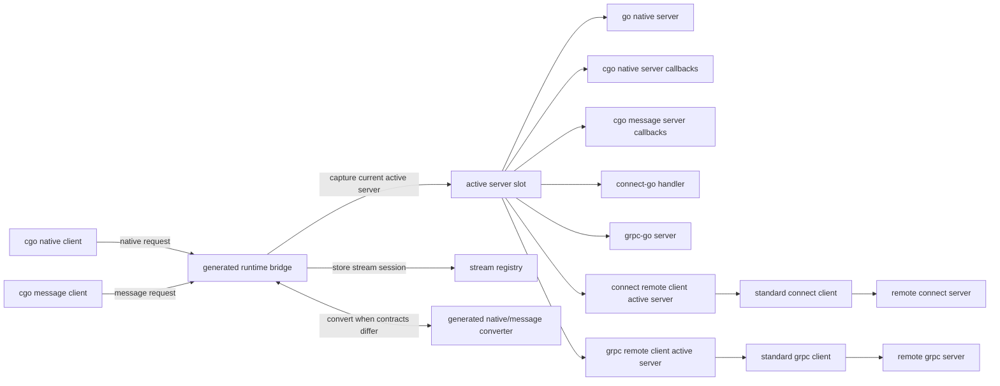

# rpccgo Modular Active Server Architecture

## 目标

新版 rpccgo 采用以 service 为边界的模块化架构。每个 generated service 只有一个 active server slot、一套 stream registry 和一套明确的 native/message 转换逻辑。所有 cgo client 调用都先进入 generated service runtime 的 runtime bridge，bridge 再根据请求类型和当前 active server 类型选择直接转发或执行参数转换。

架构目标如下：

- native 和 message 两种调用 contract 都支持 unary、client streaming、server streaming、bidi streaming。
- 每次运行只有一个 server 在监听。
- 每个 service 同一时刻只有一个 active server。
- connect 和 grpc 保持标准 RPC server/client 语义；rpccgo 不重新设计 connect handler、grpc server、connect client 或 grpc client。
- service-specific protobuf/native 转换保留在 generated code 中，通用 active slot、stream registry、stream lifecycle state 和 connect stream unsafe shim 放在 runtime 中。

## 架构图



运行时只有一个监听入口。监听入口收到请求后进入 generated service runtime 的 runtime bridge；runtime bridge 根据 active server slot 选择当前 active server，并在 native/message contract 不匹配时调用 generated converter。`rpcruntime` 只保留通用 active slot、stream registry、stream lifecycle state 和 connect stream unsafe shim 等 primitive。

## 核心概念

### Active Server Slot

active server slot 是 generated service 的底层 active server metadata primitive。cgo native client 和 cgo message client 不直接展开 active server routing，而是进入 generated service runtime 内的 runtime bridge；runtime bridge 使用 active server slot 捕获当前 active server snapshot，并使用 service-local stream registry 保存已经启动的 stream session。

active server slot 负责：

1. 保存并读取当前 active server kind、contract、adapter 和 version。
2. 在注册新 active server 时递增 version。
3. 拒绝缺失 kind、contract 或 adapter 的注册。

### Runtime Bridge

runtime bridge 是 generated service runtime 内部的 package-private typed invocation layer，不作为外部用户 API。外部包通过 generated package-level 函数进入，例如 `InvokeGreeterNativeSayHello`、`InvokeGreeterMessageSayHello`、`StartGreeterNativeCollect`、`StartGreeterMessageCollect`。bridge 内部捕获 active server snapshot，再根据 active server kind 与 contract 选择直调还是执行 native/message 转换。核心形态如下：

```text
InvokeGreeterNativeSayHello(ctx, name, city)
  -> greeterBridge.invokeNativeSayHello(ctx, name, city)

InvokeGreeterMessageSayHello(ctx, req)
  -> greeterBridge.invokeMessageSayHello(ctx, req)
```

unary 处理链路如下：

```text
capture active server snapshot
  -> match active server kind and contract
      native active + native caller: direct native call
      message active + native caller: native request -> message request -> message call -> native response
      message active + message caller: direct message call
      native active + message caller: message request -> native request -> native call -> message response
  -> precise routing / adapter / converter error
```

connect-go handler 和 grpc-go server 是 message-contract active server。bridge 直接调用用户注册的标准 handler/server；connect streaming 因 connect-go 未公开 stream constructor，由 `rpcruntime` 集中提供 unsafe stream shim，generated code 只生成 service-specific stream session glue。

runtime bridge 的调用方法保持 package-private，但其外部可观察错误应使用 exported sentinel vars，便于用户用 `errors.Is` 判断路由失败类型。没有 active server 是 `rpcruntime` 的通用失败，使用 `rpcruntime.ErrNoActiveServer`；service-specific 失败不沿用旧的 `native/message contract mismatch` 宽泛文案。通用 service-specific 失败不按 native caller/message caller 方向拆分，按 service + 失败分类命名，例如 `GreeterNativeMessageConverterUnavailableErr`、`GreeterNativeServerUnavailableErr`、`GreeterMessageServerUnavailableErr`、`GreeterUnknownActiveContractErr`。错误至少区分以下情况：

- 当前 active slot 没有 active server，返回 `rpcruntime.ErrNoActiveServer`。
- active server contract 无法服务调用端 contract，且当前生成物没有对应 native/message converter。
- active server snapshot 的 kind 与 concrete adapter 类型不一致，例如 connect handler kind 下 adapter 不是 `GreeterHandler`。
- active server snapshot contract 是未知值。

这些错误以 package-level sentinel `var` 导出，不做 method 级动态包装；router 直接返回它们，便于 `errors.Is`。

### Active Server Slot

每个 generated service 持有一个 active server slot。slot 保存当前 provider 的类型、adapter 和版本信息。注册任意 server 都会替换该 slot。新调用读取最新 slot；已经开始的 unary 调用或 stream session 继续使用启动时捕获的 adapter。

active server slot 的粒度是 service，不是整个进程。进程可以暴露一个监听 server，但不同 service 可以各自有自己的 active server。

### Active Server

active server 是 runtime bridge 的下游服务实现。不同 server kind 可以是 Go native server、C callback、connect-go handler、grpc-go server，或者 remote client active server。bridge 按 kind 直接调用对应 concrete server 或标准 transport client；remote client active server 不需要 service-specific wrapper adapter。

### Converter

converter 是 generated service 内的 native/message 双向转换层。它负责：

- native request 到 protobuf request
- protobuf request 到 native request
- native response 到 protobuf response
- protobuf response 到 native response
- streaming send/read payload 的同类转换

converter 不属于通用 runtime，因为它依赖 service-specific protobuf 类型和 native 字段 contract。

## Server 类型

新版 rpccgo 支持 7 类 server：

| Server 类型 | 接收 contract | 执行位置 | 说明 |
|---|---|---|---|
| go native server | native | 本进程 Go | Go 代码直接实现 generated native interface |
| cgo native server | native | C/FFI callback | C 侧通过导出 callback ABI 提供 native 实现 |
| cgo message server | message | C/FFI callback | C 侧通过 protobuf bytes ABI 提供 message 实现 |
| connect handler | message | 本进程 Go | 直接注册用户实现的 connect-go `GreeterHandler` |
| grpc server | message | 本进程 Go | 直接注册用户实现的 grpc-go `GreeterServer` |
| connect remote server | message | 远端进程 | active slot 直接保存标准 connect client |
| grpc remote server | message | 远端进程 | active slot 直接保存标准 grpc client |

connect remote server 和 grpc remote server 是 remote client active server，不是 rpccgo client 类型，也不需要 service-specific wrapper adapter。它们表示当前 active server 的真实执行目标在远端；active slot 保存标准 connect/gRPC client，generated runtime 按 remote kind 直接调用 client 的 unary/streaming 方法。

## Client 类型

rpccgo 只设计两类 cgo client：

| Client 类型 | 发起 contract | 说明 |
|---|---|---|
| cgo native client | native | C/FFI 侧以 native 字段 ABI 发起调用 |
| cgo message client | message | C/FFI 侧以 protobuf bytes ABI 发起调用 |

connect client 和 grpc client 属于标准 RPC 客户端，不进入 rpccgo 的 cgo client 类型模型。需要调远端 connect/grpc 服务时，通过 `Register<Service>ConnectRemoteServer` 或 `Register<Service>GRPCRemoteServer` 把标准 transport client 直接挂到 active server slot。

## 调用流

### Native client 调用 message server

```text
cgo native client
  -> runtime bridge
  -> native request to protobuf request
  -> message active server
  -> protobuf response to native response
  -> cgo native client
```

### Message client 调用 native server

```text
cgo message client
  -> runtime bridge
  -> protobuf request to native request
  -> native active server
  -> native response to protobuf response
  -> cgo message client
```

### Contract 匹配的调用

```text
cgo native client
  -> runtime bridge
  -> native active server
```

```text
cgo message client
  -> runtime bridge
  -> message active server
```

contract 匹配时 runtime bridge 不做额外 native/message 转换。

## Streaming 合同

所有 streaming active server 必须按 method streaming kind 实现统一生命周期。

| RPC 类型 | 操作 |
|---|---|
| unary | `Invoke` |
| client streaming | `Start`、`Send`、`Finish`、`Cancel` |
| server streaming | `Start`、`Cancel`、`onRead`、`onDone` |
| bidi streaming | `Start`、`Send`、`CloseSend`、`Cancel`、`onRead`、`onDone` |

streaming 规则：

- `Start` 由 runtime bridge 做 active server 选择，并通过 active slot 捕获当前 active server snapshot。
- `Start` 将 native session、message session，或转换后的 stream wrapper 存入 service-local stream registry。
- `Send`、`Finish`、`Recv`、`Done`、`CloseSend`、`Cancel` 都通过 handle 找回启动时固定的 session。
- `Cancel` 必须向 active server session 传播取消，并让 session 进入终态。
- `Finish` 只用于 client streaming。
- `CloseSend` 只用于 bidi streaming。
- `onRead` 和 `onDone` 用于 server streaming 与 bidi streaming。
- native streaming 和 message streaming 使用相同 session 生命周期，不再维护两套语义。

streaming `Start` 处理链路如下：

```text
StartNativeCollect
  -> greeterBridge.startNativeCollect(ctx)
      -> capture active server snapshot
      -> choose native session or message-to-native wrapper
      -> store final session in service-local stream registry
  -> stream handle
```

后续 stream 操作不重新选择 active server；它们只通过 handle 找回 `Start` 时存入 registry 的 session，并按 stream lifecycle 规则推进或终结该 session。

## 模块边界

### rpcruntime

`rpcruntime` 只承载通用、非 service-specific 的能力：

- active server slot primitive
- stream handle allocator
- stream session table
- stream lifecycle state
- connect stream unsafe constructor shim
- error store
- cgo memory wrapper

`rpcruntime` 不依赖 protobuf service 类型，不执行 native/message 转换。

### generated service runtime

generated service runtime 承载 service-specific 能力：

- runtime bridge
- active server registration API
- service-local stream registry binding
- native/message converter
- method metadata
- cgo client ABI
- cgo server callback ABI
- connect/grpc local active server direct invocation
- connect/grpc remote client direct invocation

## 注册语义

每个 server registration API 都只做一件事：把用户提供的 server、handler、callback adapter 或 remote transport client 写入 active server slot。connect-go handler、grpc-go server 和 remote transport client 直接注册，不再先包装成 service-specific message adapter。

示例注册入口：

```text
Register<Service>GoNativeServer(server)
Register<Service>CGONativeServer(callbacks)
Register<Service>CGOMessageServer(callbacks)
Register<Service>ConnectHandler(handler)
Register<Service>GRPCServer(server)
Register<Service>ConnectRemoteServer(client)
Register<Service>GRPCRemoteServer(client)
```

remote registration API 保留 `Register<Service>ConnectRemoteServer` 与 `Register<Service>GRPCRemoteServer` 命名，但不引入 `@remote` 注释。它们接收标准 connect/gRPC client，直接注册到 active slot，并返回 client-typed snapshot，例如 `AdapterSnapshot[GreeterClient]`。`ServerKindConnectRemote` 与 `ServerKindGRPCRemote` 保留为独立 kind，因为远端 client 与本地 connect handler/gRPC server 的 concrete adapter 类型不同。

同一 service 不允许在一次 bootstrap 中注册多个候选 server。若需要切换 server，必须显式重新注册，后注册的 server 只影响后续调用。

## 监听模型

每次运行只有一个 server 监听。该监听 server 可以是 connect 或 grpc transport，也可以是承载 cgo exported ABI 的进程入口。监听 server 不等于 active server 类型；active server 类型描述 runtime bridge 当前调用的执行目标。

标准 connect/grpc 监听入口由用户使用 `protoc-gen-connect-go` 或 `protoc-gen-go-grpc` 生成物自行搭建。rpccgo 不生成本地 connect/grpc transport handler；C 端调用进入 generated runtime bridge 后，bridge 直接调用当前 active slot 中注册的 connect-go handler、grpc-go server、native server、C callback 或 remote transport client。

## 生成物布局

rpccgo 使用一个 protobuf 插件：`protoc-gen-rpc-cgo`。插件内部按职责拆分 parser、planner 和 renderer，不为不同 server 类型拆成多个 protoc 插件。

单插件负责读取同一个 service 的注释、建立统一 `ServicePlan`，再按 plan 调用不同 renderer。这样可以保证 runtime bridge、active server slot、codec、cgo client ABI 和 active server registration 使用同一个 service 视图，避免多个插件重复生成或生成互相不一致的 service runtime。

### Service 生成注释

用户可以在 proto service 前使用 `@rpccgo` 注释选择要生成的 server adapter：

```proto
// @rpccgo:msg-connect
service Greeter {}

// @rpccgo:msg-grpc
service Greeter {}

// @rpccgo:msg-connect|native
service Greeter {}

// @rpccgo:msg-grpc|native
service Greeter {}
```

没有 `@rpccgo` 注释时，默认等价于：

```proto
// @rpccgo:msg-connect
service Greeter {}
```

支持的 token：

| Token | 生成内容 |
|---|---|
| `msg-connect` | connect-go handler active server registration 与 bridge 调用支持 |
| `msg-grpc` | grpc-go server active server registration 与 bridge 调用支持 |
| `native` | go native server 与 cgo native server callback 支持 |

注释规则：

- `native` 单独出现会默认生成msg-connect + native。
- message transport 必须在 `msg-connect` 和 `msg-grpc` 中只选择一个；`msg-connect|msg-grpc` 与 `msg-connect|msg-grpc|native` 必须报错。
- 未知 token 必须报错，并给出合法 token 提示。
- 常见拼写错误如 `msg-conenct` 必须报错，不能静默忽略。

`@rpccgo` 注释只控制 active server registration 与 bridge 调用支持。`msg-connect` 假定最终 Go package 中会存在 `protoc-gen-connect-go` 生成的 handler 类型；`msg-grpc` 假定最终 Go package 中会存在 `protoc-gen-go-grpc` 生成的 server 类型。rpccgo 不检查插件执行顺序，也不生成本地 connect/grpc transport handler。cgo native client 和 cgo message client 的生成策略不由该注释控制。

connect 和 gRPC 不能在同一个 protobuf Go package 中同时按当前合同生成。connect-go 需要使用同包 simple client，grpc-go 也会在同包生成 `GreeterClient`、`NewGreeterClient` 等符号；两者同时生成会发生 Go 符号重声明，因此同一个 service 必须只选择一种 message transport。

每个 service 推荐生成一组以 `<proto-prefix>.<service>` 为前缀的文件族。普通 Go 文件保留在 protobuf Go package 输出目录：

```text
<proto-prefix>.<service>.runtime.rpccgo.go
<proto-prefix>.<service>.codec.rpccgo.go
<proto-prefix>.<service>.server.native.rpccgo.go
```

cgo 文件输出到 `cgo_dir`，使用 `package main`，因此 native/message contract token 必须显式：

```text
<cgo-dir>/<proto-prefix>.exports.cgo.rpccgo.go
<cgo-dir>/<proto-prefix>.<service>.server.native.cgo.rpccgo.go
<cgo-dir>/<proto-prefix>.<service>.client.native.cgo.rpccgo.go
<cgo-dir>/<proto-prefix>.<service>.server.message.cgo.rpccgo.go
<cgo-dir>/<proto-prefix>.<service>.client.message.cgo.rpccgo.go
```

职责划分：

- `runtime` 保存 runtime bridge、active slot、service-local stream registry binding、server registration、connect/grpc local active server direct invocation、connect/grpc remote client direct invocation 和 session glue。
- `codec` 保存 native/message 转换。
- `server.native` 保存 Go native server interface 和 adapter，仅在 `native` 启用时生成。
- `exports.cgo` 保存 cgo package shared exports。
- `server.native.cgo` 保存 cgo native server callback ABI。
- `client.native.cgo` 保存 cgo native client ABI。
- `server.message.cgo` 保存 cgo message server callback ABI。
- `client.message.cgo` 保存 cgo message client ABI。

## 错误处理

错误按调用边界转换：

- Go adapter 返回 `error`。
- cgo ABI 返回 status code，并通过 runtime error store 或 explicit error output 返回错误文本。
- message contract 中 protobuf marshal/unmarshal 失败必须直接返回错误。
- native/message 转换失败必须直接返回错误。
- stream `onDone` 必须携带终态错误。
- callback 缺失、active server 未注册、stream handle 不存在都返回明确错误。

## 验收标准

架构实现完成后应满足：

1. 每个 service 只有一个 active server slot。
2. 每次运行只有一个监听 server。
3. cgo native client 和 cgo message client 都通过 runtime bridge 调用。
4. 7 类 server 都能注册为 active server。
5. runtime bridge 能在 native/message contract 不匹配时完成转换。
6. native 和 message 都支持 unary、client streaming、server streaming、bidi streaming。
7. stream session 在 `Start` 时捕获 active server，后续操作不受重新注册影响。
8. 本地 connect-go handler 和 grpc-go server 直接注册为 message active server，不生成本地 transport ingress 文件。
9. connect/grpc remote client active server 直接注册标准 connect/grpc client，runtime bridge 按 remote kind 直接调用 client 方法。
10. `rpcruntime` 不依赖 service-specific protobuf 类型。
11. generated converter 覆盖 request、response 和 streaming payload 的双向转换。
