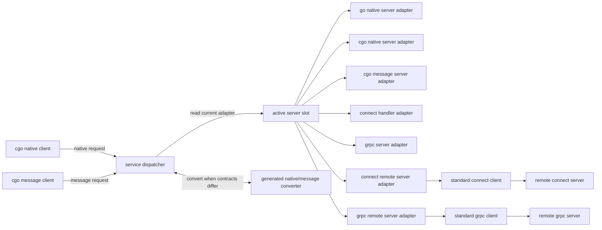

# rpccgo Modular Dispatcher Architecture

## 目标

新版 rpccgo 采用以 service 为边界的模块化架构。每个 generated service 只有一个运行时 dispatcher、一个 active server slot 和一套明确的 native/message 转换逻辑。所有 cgo client 调用都先进入 dispatcher，dispatcher 再根据请求类型和当前 active server 类型选择直接转发或执行参数转换。

架构目标如下：

- native 和 message 两种调用 contract 都支持 unary、client streaming、server streaming、bidi streaming。
- 每次运行只有一个 server 在监听。
- 每个 service 同一时刻只有一个 active server。
- connect 和 grpc 保持标准 RPC transport 语义；rpccgo 不重新设计 connect client 或 grpc client。
- service-specific protobuf/native 转换保留在 generated code 中，通用状态与 session 生命周期放在 runtime 中。

## 架构图



运行时只有一个监听入口。监听入口收到请求后进入 generated service runtime 的 active router；active router 根据 active server slot 选择当前 server adapter，并在 native/message contract 不匹配时调用 generated converter。底层 dispatcher 只保留通用 snapshot capture 与 stream registry primitive。

## 核心概念

### Dispatcher

dispatcher 是 generated service 的底层调度 primitive。cgo native client 和 cgo message client 不直接展开 active server routing，而是进入 generated service runtime 内的 active router；active router 复用 dispatcher 完成 snapshot capture 与 stream registry 操作。dispatcher 负责：

1. 保存并读取当前 active server snapshot。
2. 为 unary 调用提供 capture/invoke primitive。
3. 在 stream `Start` 时捕获 active server snapshot。
4. 保存转换后的 stream session，并让后续 stream 操作固定路由到该 session。

### Runtime Bridge

runtime bridge 是 generated service runtime 内部的 package-private typed invocation layer，不作为外部用户 API。外部包通过 generated package-level 函数进入，例如 `InvokeGreeterNativeSayHello`、`InvokeGreeterMessageSayHello`、`StartGreeterNativeCollect`、`StartGreeterMessageCollect`。bridge 内部再根据 active server contract 选择直调还是执行 native/message 转换。核心形态如下：

```text
InvokeGreeterNativeSayHello(ctx, name, city)
  -> greeterBridge.invokeNativeSayHello(ctx, name, city)

InvokeGreeterMessageSayHello(ctx, req)
  -> greeterBridge.invokeMessageSayHello(ctx, req)
```

unary 处理链路如下：

```text
capture active server snapshot
  -> match active server contract
      native active + native caller: direct native call
      message active + native caller: native request -> message request -> message call -> native response
      message active + message caller: direct message call
      native active + message caller: message request -> native request -> native call -> message response
  -> precise routing / adapter / converter error
```

active router 的调用方法保持 package-private，但其外部可观察错误应使用 exported sentinel vars，便于用户用 `errors.Is` 判断路由失败类型。没有 active server 是 runtime core 的通用失败，使用 `rpcruntime.ErrNoActiveServer`；service-specific 失败不沿用旧的 `native/message contract mismatch` 宽泛文案。通用 service-specific 失败不按 native caller/message caller 方向拆分，按 service + 失败分类命名，例如 `GreeterNativeMessageConverterUnavailableErr`、`GreeterNativeAdapterUnavailableErr`、`GreeterMessageAdapterUnavailableErr`、`GreeterUnknownActiveContractErr`。错误至少区分以下情况：

- 当前 dispatcher 没有 active server，返回 `rpcruntime.ErrNoActiveServer`。
- active server contract 无法服务调用端 contract，且当前生成物没有对应 native/message converter。
- active server snapshot 的 contract 与 adapter 字段不一致，例如 native contract 下 native adapter 为 nil。
- active server snapshot contract 是未知值。

这些错误以 package-level sentinel `var` 导出，不做 method 级动态包装；router 直接返回它们，便于 `errors.Is`。

### Active Server Slot

每个 generated service 持有一个 active server slot。slot 保存当前 provider 的类型、adapter 和版本信息。注册任意 server 都会替换该 slot。新调用读取最新 slot；已经开始的 unary 调用或 stream session 继续使用启动时捕获的 adapter。

active server slot 的粒度是 service，不是整个进程。进程可以暴露一个监听 server，但不同 service 可以各自有自己的 active server adapter。

### Server Adapter

server adapter 是 dispatcher 的下游统一接口。不同 server 类型通过 adapter 暴露相同的 unary 与 streaming 调用能力。adapter 内部可以调用 Go 实现、C callback、connect handler、grpc server，或者标准 connect/grpc client。

### Converter

converter 是 generated service 内的 native/message 双向转换层。它负责：

- native request 到 protobuf request
- protobuf request 到 native request
- native response 到 protobuf response
- protobuf response 到 native response
- streaming send/read payload 的同类转换

converter 不属于通用 runtime，因为它依赖 service-specific protobuf 类型和 native 字段 contract。

## Server 类型

新版 rpccgo 支持 7 类 server：

| Server 类型 | 接收 contract | 执行位置 | 说明 |
|---|---|---|---|
| go native server | native | 本进程 Go | Go 代码直接实现 generated native interface |
| cgo native server | native | C/FFI callback | C 侧通过导出 callback ABI 提供 native 实现 |
| cgo message server | message | C/FFI callback | C 侧通过 protobuf bytes ABI 提供 message 实现 |
| connect handler | message | 本进程 Go | 复用 generated connect handler contract |
| grpc server | message | 本进程 Go | 复用 generated grpc server contract |
| connect remote server | message | 远端进程 | adapter 内部持有标准 connect client |
| grpc remote server | message | 远端进程 | adapter 内部持有标准 grpc client |

connect remote server 和 grpc remote server 是 server adapter 类型，不是 rpccgo client 类型。它们表示当前 active server 的真实执行目标在远端。

## Client 类型

rpccgo 只设计两类 cgo client：

| Client 类型 | 发起 contract | 说明 |
|---|---|---|
| cgo native client | native | C/FFI 侧以 native 字段 ABI 发起调用 |
| cgo message client | message | C/FFI 侧以 protobuf bytes ABI 发起调用 |

connect client 和 grpc client 属于标准 RPC 客户端，不进入 rpccgo 的 client 类型模型。需要调远端 connect/grpc 服务时，通过 connect remote server adapter 或 grpc remote server adapter 挂到 active server slot。

## 调用流

### Native client 调用 message server

```text
cgo native client
  -> dispatcher
  -> native request to protobuf request
  -> message server adapter
  -> protobuf response to native response
  -> cgo native client
```

### Message client 调用 native server

```text
cgo message client
  -> dispatcher
  -> protobuf request to native request
  -> native server adapter
  -> native response to protobuf response
  -> cgo message client
```

### Contract 匹配的调用

```text
cgo native client
  -> dispatcher
  -> native server adapter
```

```text
cgo message client
  -> dispatcher
  -> message server adapter
```

contract 匹配时 dispatcher 不做额外转换。

## Streaming 合同

所有 server adapter 必须按 method streaming kind 实现统一生命周期。

| RPC 类型 | 操作 |
|---|---|
| unary | `Invoke` |
| client streaming | `Start`、`Send`、`Finish`、`Cancel` |
| server streaming | `Start`、`Cancel`、`onRead`、`onDone` |
| bidi streaming | `Start`、`Send`、`CloseSend`、`Cancel`、`onRead`、`onDone` |

streaming 规则：

- `Start` 由 active router 做 active server 选择，并通过 dispatcher 捕获当前 active server adapter。
- `Start` 将 native session、message session，或转换后的 stream wrapper 存入 dispatcher 的 stream registry。
- `Send`、`Finish`、`Recv`、`Done`、`CloseSend`、`Cancel` 都通过 handle 找回启动时固定的 session。
- `Cancel` 必须向 adapter 传播取消，并让 session 进入终态。
- `Finish` 只用于 client streaming。
- `CloseSend` 只用于 bidi streaming。
- `onRead` 和 `onDone` 用于 server streaming 与 bidi streaming。
- native streaming 和 message streaming 使用相同 session 生命周期，不再维护两套语义。

streaming `Start` 处理链路如下：

```text
StartNativeCollect
  -> greeterRouter.StartNativeCollect(ctx)
      -> dispatcher.StartStream(...)
          -> capture active server snapshot
          -> choose native session or message-to-native wrapper
          -> store final session in stream registry
  -> stream handle
```

后续 stream 操作不重新选择 active server；它们只通过 handle 找回 `Start` 时存入 registry 的 session，并按 stream lifecycle 规则推进或终结该 session。

## 模块边界

### rpcruntime

`rpcruntime` 只承载通用、非 service-specific 的能力：

- active server slot primitive
- stream handle allocator
- stream session table
- session finalization helper
- cancel propagation helper
- error store
- cgo memory wrapper

`rpcruntime` 不依赖 protobuf service 类型，不执行 native/message 转换。

### generated service runtime

generated service runtime 承载 service-specific 能力：

- dispatcher 外壳
- server adapter 定义
- server registration API
- native/message converter
- method metadata
- cgo client ABI
- cgo server callback ABI
- connect/grpc local adapter
- connect/grpc remote adapter

## 注册语义

每个 server registration API 都只做一件事：构造 server adapter 并写入 active server slot。

示例注册入口：

```text
Register<Service>GoNativeServer(server)
Register<Service>CGONativeServer(callbacks)
Register<Service>CGOMessageServer(callbacks)
Register<Service>ConnectHandler(handler)
Register<Service>GRPCServer(server)
Register<Service>ConnectRemoteServer(client)
Register<Service>GRPCRemoteServer(client)
```

同一 service 不允许在一次 bootstrap 中注册多个候选 server。若需要切换 server，必须显式重新注册，后注册的 server 只影响后续调用。

## 监听模型

每次运行只有一个 server 监听。该监听 server 可以是 connect 或 grpc transport，也可以是承载 cgo exported ABI 的进程入口。监听 server 不等于 active server 类型；active server 类型描述 dispatcher 当前调用的执行目标。

connect/grpc 监听入口只负责接收标准 RPC 请求并进入 dispatcher。dispatcher 决定请求最终落到 go native、cgo native、cgo message、本地 connect/grpc handler，还是远端 connect/grpc server。

## 生成物布局

rpccgo 使用一个 protobuf 插件：`protoc-gen-rpc-cgo`。插件内部按职责拆分 parser、planner 和 renderer，不为不同 server 类型拆成多个 protoc 插件。

单插件负责读取同一个 service 的注释、建立统一 `ServicePlan`，再按 plan 调用不同 renderer。这样可以保证 dispatcher、active server slot、codec、cgo client ABI 和 server adapter 使用同一个 service 视图，避免多个插件重复生成或生成互相不一致的 service runtime。

### Service 生成注释

用户可以在 proto service 前使用 `@rpccgo` 注释选择要生成的 server adapter：

```proto
// @rpccgo:msg-connect
service Greeter {}

// @rpccgo:msg-grpc
service Greeter {}

// @rpccgo:msg-connect|msg-grpc
service Greeter {}

// @rpccgo:msg-connect|native
service Greeter {}
```

没有 `@rpccgo` 注释时，默认等价于：

```proto
// @rpccgo:msg-connect
service Greeter {}
```

支持的 token：

| Token | 生成内容 |
|---|---|
| `msg-connect` | connect message server adapter |
| `msg-grpc` | grpc message server adapter |
| `native` | go native server adapter 与 cgo native server adapter |

注释规则：

- `native` 单独出现会默认生成msg-connect + native。
- `msg-connect|msg-grpc|native` 合法。
- 未知 token 必须报错，并给出合法 token 提示。
- 常见拼写错误如 `msg-conenct` 必须报错，不能静默忽略。

`@rpccgo` 注释只控制 server adapter 生成。cgo native client 和 cgo message client 的生成策略不由该注释控制。

每个 service 推荐生成一组以 `<proto-prefix>.<service>` 为前缀的文件族。普通 Go 文件保留在 protobuf Go package 输出目录：

```text
<proto-prefix>.<service>.runtime.rpccgo.go
<proto-prefix>.<service>.codec.rpccgo.go
<proto-prefix>.<service>.server.native.rpccgo.go
<proto-prefix>.<service>.server.connect.rpccgo.go
<proto-prefix>.<service>.server.grpc.rpccgo.go
<proto-prefix>.<service>.remote.connect.rpccgo.go
<proto-prefix>.<service>.remote.grpc.rpccgo.go
```

cgo 文件输出到 `cgo_dir`，使用 `package main`，因此 native/message contract token 必须显式：

```text
<cgo-dir>/<proto-prefix>.exports.cgo.rpccgo.go
<cgo-dir>/<proto-prefix>.<service>.server.native.cgo.rpccgo.go
<cgo-dir>/<proto-prefix>.<service>.client.native.cgo.rpccgo.go
<cgo-dir>/<proto-prefix>.<service>.server.message.cgo.rpccgo.go
<cgo-dir>/<proto-prefix>.<service>.client.message.cgo.rpccgo.go
```

职责划分：

- `runtime` 保存 dispatcher、active slot 和 session glue。
- `codec` 保存 native/message 转换。
- `server.native` 保存 Go native server interface 和 adapter，仅在 `native` 启用时生成。
- `server.connect` 保存 connect handler adapter，仅在 `msg-connect` 启用时生成。
- `server.grpc` 保存 grpc server adapter，仅在 `msg-grpc` 启用时生成。
- `remote.connect` 保存 connect remote server adapter。
- `remote.grpc` 保存 grpc remote server adapter。
- `exports.cgo` 保存 cgo package shared exports。
- `server.native.cgo` 保存 cgo native server callback ABI。
- `client.native.cgo` 保存 cgo native client ABI。
- `server.message.cgo` 保存 cgo message server callback ABI。
- `client.message.cgo` 保存 cgo message client ABI。

## 错误处理

错误按调用边界转换：

- Go adapter 返回 `error`。
- cgo ABI 返回 status code，并通过 runtime error store 或 explicit error output 返回错误文本。
- message contract 中 protobuf marshal/unmarshal 失败必须直接返回错误。
- native/message 转换失败必须直接返回错误。
- stream `onDone` 必须携带终态错误。
- callback 缺失、active server 未注册、stream handle 不存在都返回明确错误。

## 验收标准

架构实现完成后应满足：

1. 每个 service 只有一个 active server slot。
2. 每次运行只有一个监听 server。
3. cgo native client 和 cgo message client 都通过 dispatcher 调用。
4. 7 类 server 都能注册为 active server。
5. dispatcher 能在 native/message contract 不匹配时完成转换。
6. native 和 message 都支持 unary、client streaming、server streaming、bidi streaming。
7. stream session 在 `Start` 时捕获 active server，后续操作不受重新注册影响。
8. connect/grpc remote server adapter 复用标准 connect/grpc client。
9. `rpcruntime` 不依赖 service-specific protobuf 类型。
10. generated converter 覆盖 request、response 和 streaming payload 的双向转换。
