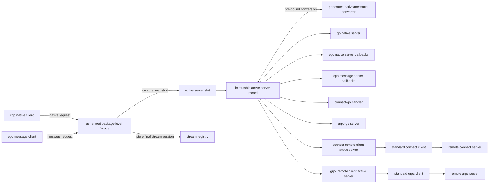

# rpccgo Modular Active Server Architecture

## 目标

新版 rpccgo 采用以 service 为边界的模块化架构。每个 generated service 只有一个 active server slot、一套 stream registry 和一套明确的 native/message 转换逻辑。注册阶段把具体 server 归一化为不可变 service-local active server record，并为每个 caller contract 组装 method closure。调用阶段只捕获 record snapshot 并调用 closure，不再按 server kind 或 contract 分支。

架构目标如下：

- native 和 message 两种调用 contract 都支持 unary、client streaming、server streaming、bidi streaming。
- 每次运行只有一个 server 在监听。
- 每个 service 同一时刻只有一个 active server。
- connect 和 grpc 保持标准 RPC server/client 语义；rpccgo 不重新设计 connect handler、grpc server、connect client 或 grpc client。
- service-specific typed atomic active slot、protobuf/native 转换保留在 generated code 中，通用 stream registry、stream lifecycle state 和 connect stream unsafe shim 放在 runtime 中。

## 架构图



运行时只有一个监听入口。监听入口收到请求后进入 generated package-level facade；facade 从 active server slot 捕获 immutable record snapshot，并调用 caller contract 对应的 closure。native/message contract 不匹配时所需的 converter 已在注册阶段绑定进 closure。`rpcruntime` 只保留 stream registry、stream lifecycle state 和 connect stream unsafe shim 等通用 primitive。

## 核心概念

### Active Server Slot

active server slot 是 generated service-local typed `atomic.Pointer[record]`。cgo native client 和 cgo message client 通过 generated package-level facade 读取当前 immutable active server record；stream `Start` 使用 service-local stream registry 保存已经启动的 final session。

active server slot 负责：

1. 保存并读取当前 immutable active server record。
2. 只在完整 record 构造成功后原子替换 snapshot。

active slot 不进入 `rpcruntime`。项目不保留 `rpcruntime.ActiveServerSlot`、`ServerKind`、`ServerContract`、`AdapterSnapshot` 或 version metadata。

### Active Server Record

active server record 是 generated service runtime 内部的 package-private immutable 调用表。注册入口校验完整 service 能力后，为每个 method 组装 caller-facing closure。外部包只通过 generated package-level 函数进入，例如 `InvokeGreeterNativeSayHello`、`InvokeGreeterMessageSayHello`、`StartGreeterNativeCollect`、`StartGreeterMessageCollect`。

```text
InvokeGreeterNativeSayHello(ctx, name, city)
  -> load active record snapshot
  -> record.invokeNativeSayHello(ctx, name, city)

InvokeGreeterMessageSayHello(ctx, req)
  -> load active record snapshot
  -> record.invokeMessageSayHello(ctx, req)
```

unary 处理链路如下：

```text
capture immutable active server record
  -> invoke caller-facing closure
      direct call when contracts match
      pre-bound conversion and call when contracts differ
```

connect-go handler 和 grpc-go server 是 message-contract registration input。generated runtime 在注册阶段把它们归一化为 active server record；connect streaming 因 connect-go 未公开 stream constructor，由 `rpcruntime` 集中提供 unsafe stream shim，generated code 只生成 service-specific final session glue。

没有 active server 时返回 `rpcruntime.ErrNoActiveServer`。注册入口必须在发布 record 前拒绝不完整 server、缺失 callback 或无法组装 closure 的情况。调用阶段不保留以下不可能状态的 routing sentinel：

- converter unavailable
- active contract unknown
- server kind 与 concrete server 类型不一致

### Active Server

active server 是 record closure 最终调用的服务实现。它可以是 Go native server、C callback、connect-go handler、grpc-go server，或者 remote client active server。server 类型差异只在注册阶段处理；调用阶段不再分支。remote client active server 不需要独立 service-specific wrapper adapter 文件。

### Converter

converter 是 generated service 内的 native/message 双向转换层。它负责：

- native request 到 protobuf request
- protobuf request 到 native request
- native response 到 protobuf response
- protobuf response 到 native response
- streaming send/read payload 的同类转换

converter 不属于通用 runtime，因为它依赖 service-specific protobuf 类型和 native 字段 contract。

## Server 类型

新版 rpccgo 支持 7 类 server：

| Server 类型 | 接收 contract | 执行位置 | 说明 |
|---|---|---|---|
| go native server | native | 本进程 Go | Go 代码直接实现 generated native interface |
| cgo native server | native | C/FFI callback | C 侧通过导出 callback ABI 提供 native 实现 |
| cgo message server | message | C/FFI callback | C 侧通过 protobuf bytes ABI 提供 message 实现 |
| connect handler | message | 本进程 Go | 直接注册用户实现的 connect-go `GreeterHandler` |
| grpc server | message | 本进程 Go | 直接注册用户实现的 grpc-go `GreeterServer` |
| connect remote server | message | 远端进程 | 标准 connect client 作为注册输入 |
| grpc remote server | message | 远端进程 | 标准 grpc client 作为注册输入 |

connect remote server 和 grpc remote server 是 remote client active server，不是 rpccgo client 类型，也不需要独立 service-specific wrapper adapter 文件。它们表示当前 active server 的真实执行目标在远端；generated runtime 在注册阶段把标准 connect/gRPC client 归一化为 active server record closure。

## Client 类型

rpccgo 只设计两类 cgo client：

| Client 类型 | 发起 contract | 说明 |
|---|---|---|
| cgo native client | native | C/FFI 侧以 native 字段 ABI 发起调用 |
| cgo message client | message | C/FFI 侧以 protobuf bytes ABI 发起调用 |

connect client 和 grpc client 属于标准 RPC 客户端，不进入 rpccgo 的 cgo client 类型模型。需要调远端 connect/grpc 服务时，通过 `Register<Service>ConnectRemoteServer` 或 `Register<Service>GRPCRemoteServer` 把标准 transport client 注册为 active server record。

## 调用流

### Native client 调用 message server

```text
cgo native client
  -> generated native facade
  -> active record native closure
  -> native request to protobuf request
  -> message server
  -> protobuf response to native response
  -> cgo native client
```

### Message client 调用 native server

```text
cgo message client
  -> generated message facade
  -> active record message closure
  -> protobuf request to native request
  -> native server
  -> native response to protobuf response
  -> cgo message client
```

### Contract 匹配的调用

```text
cgo native client
  -> generated native facade
  -> active record native closure
  -> native server
```

```text
cgo message client
  -> generated message facade
  -> active record message closure
  -> message server
```

contract 匹配时 active record closure 不做额外 native/message 转换。

## Streaming 合同

所有 streaming active server 必须按 method streaming kind 实现统一生命周期。

| RPC 类型 | 操作 |
|---|---|
| unary | `Invoke` |
| client streaming | `Start`、`Send`、`Finish`、`Cancel` |
| server streaming | `Start`、`Recv`、`Finish`、`Cancel` |
| bidi streaming | `Start`、`Send`、`Recv`、`CloseSend`、`Finish`、`Cancel` |

streaming 规则：

- `Start` 通过 active slot 捕获 immutable active server record snapshot，并调用 caller contract 对应的 start closure。
- `Start` 组装并存储一个 `method + caller contract` 对应的 final session；conversion closure 直接编入 final session，不生成 wrapper session 层。
- `Send`、`Recv`、`Finish`、`CloseSend`、`Cancel` 都通过 handle 找回启动时固定的 final session。
- `Cancel` 必须向 active server session 传播取消，并让 session 进入终态。
- `Finish` 是所有 stream 的统一 graceful terminal。
- `CloseSend` 只用于 bidi streaming。
- native streaming 和 message streaming 使用相同 session 生命周期，不再维护两套语义。
- runtime lifecycle 只表达状态，不根据 client/server/bidi kind 分支。生成计划只表达 `CanSend`、`CanRecv`、`CanCloseSend`、`FinishReturnsResponse` 差异。

streaming `Start` 处理链路如下：

```text
StartNativeCollect
  -> capture active server record snapshot
  -> record.startNativeCollect(ctx)
      -> assemble final native caller session
      -> store final session in service-local stream registry
  -> stream handle
```

后续 stream 操作不重新选择 active server；它们只通过 handle 找回 `Start` 时存入 registry 的 session，并按 stream lifecycle 规则推进或终结该 session。

## 模块边界

### rpcruntime

`rpcruntime` 只承载通用、非 service-specific 的能力：

- stream handle allocator
- stream session table
- stream lifecycle state
- connect stream unsafe constructor shim
- error store
- cgo memory wrapper

`rpcruntime` 不依赖 protobuf service 类型，不执行 native/message 转换，不保留 active slot wrapper、dispatcher、executor、`StreamEntry` 或 registry lifecycle helper。

### generated service runtime

generated service runtime 承载 service-specific 能力：

- immutable active server record
- typed atomic active server slot
- package-level invoke/start facade
- active server registration API
- service-local stream registry binding
- native/message converter
- method metadata
- cgo client ABI
- cgo server callback ABI
- connect/grpc local active server direct invocation
- connect/grpc remote client direct invocation
- method + caller contract final session

## 注册语义

每个 server registration API 都只做一件事：校验用户提供的 server、handler、完整 callback set 或 remote transport client，归一化为不可变 service-local active server record，最后原子替换 active server slot。connect-go handler、grpc-go server 和 remote transport client 直接作为注册输入，不再先包装成独立 service-specific message adapter 文件。

示例注册入口：

```text
Register<Service>GoNativeServer(server)
Register<Service>CGONativeServer(callbacks)
Register<Service>CGOMessageServer(callbacks)
Register<Service>ConnectHandler(handler)
Register<Service>GRPCServer(server)
Register<Service>ConnectRemoteServer(client)
Register<Service>GRPCRemoteServer(client)
```

C native/message callback 使用 service-level flat callback 参数注册，不传递 callback table struct，也不允许按 method 增量激活。缺失 callback 必须在注册时返回错误；校验失败时 active slot 保持不变。

remote registration API 保留 `Register<Service>ConnectRemoteServer` 与 `Register<Service>GRPCRemoteServer` 命名，但不引入 `@remote` 注释。它们接收标准 connect/gRPC client，归一化为 active server record，并返回 `error`。远端 client 与本地 connect handler/gRPC server 的类型差异只在注册阶段处理。

同一 service 不允许在一次 bootstrap 中注册多个候选 server。若需要切换 server，必须显式重新注册，后注册的 server 只影响后续调用。

## 监听模型

每次运行只有一个 server 监听。该监听 server 可以是 connect 或 grpc transport，也可以是承载 cgo exported ABI 的进程入口。监听 server 不等于 active server 类型；active server 类型描述 active record closure 最终调用的执行目标。

标准 connect/grpc 监听入口由用户使用 `protoc-gen-connect-go` 或 `protoc-gen-go-grpc` 生成物自行搭建。rpccgo 不生成本地 connect/grpc transport handler；C 端调用进入 generated package-level facade 后，facade 捕获 active record snapshot 并调用预先组装的 closure。

## 生成物布局

rpccgo 使用一个 protobuf 插件：`protoc-gen-rpc-cgo`。插件内部按职责拆分 parser、planner 和 renderer，不为不同 server 类型拆成多个 protoc 插件。

单插件负责读取同一个 service 的注释、建立统一 `ServicePlan`，再按 plan 调用不同 renderer。这样可以保证 active server record、active server slot、codec、cgo client ABI 和 active server registration 使用同一个 service 视图，避免多个插件重复生成或生成互相不一致的 service runtime。

### Service 生成注释

用户可以在 proto service 前使用 `@rpccgo` 注释选择要生成的 server registration：

```proto
// @rpccgo:msg-connect
service Greeter {}

// @rpccgo:msg-grpc
service Greeter {}

// @rpccgo:msg-connect|native
service Greeter {}

// @rpccgo:msg-grpc|native
service Greeter {}
```

没有 `@rpccgo` 注释时，默认等价于：

```proto
// @rpccgo:msg-connect
service Greeter {}
```

支持的 token：

| Token | 生成内容 |
|---|---|
| `msg-connect` | connect-go handler active server registration 与 generated facade 调用支持 |
| `msg-grpc` | grpc-go server active server registration 与 generated facade 调用支持 |
| `native` | go native server 与 cgo native server callback 支持 |

注释规则：

- `native` 单独出现会默认生成msg-connect + native。
- message transport 必须在 `msg-connect` 和 `msg-grpc` 中只选择一个；`msg-connect|msg-grpc` 与 `msg-connect|msg-grpc|native` 必须报错。
- 未知 token 必须报错，并给出合法 token 提示。
- 常见拼写错误如 `msg-conenct` 必须报错，不能静默忽略。

`@rpccgo` 注释只控制 active server registration 与 generated facade 调用支持。`msg-connect` 假定最终 Go package 中会存在 `protoc-gen-connect-go` 生成的 handler 类型；`msg-grpc` 假定最终 Go package 中会存在 `protoc-gen-go-grpc` 生成的 server 类型。rpccgo 不检查插件执行顺序，也不生成本地 connect/grpc transport handler。cgo native client 和 cgo message client 的生成策略不由该注释控制。

connect 和 gRPC 不能在同一个 protobuf Go package 中同时按当前合同生成。connect-go 需要使用同包 simple client，grpc-go 也会在同包生成 `GreeterClient`、`NewGreeterClient` 等符号；两者同时生成会发生 Go 符号重声明，因此同一个 service 必须只选择一种 message transport。

每个 service 推荐生成一组以 `<proto-prefix>.<service>` 为前缀的文件族。普通 Go 文件保留在 protobuf Go package 输出目录：

```text
<proto-prefix>.<service>.runtime.rpccgo.go
<proto-prefix>.<service>.codec.rpccgo.go
<proto-prefix>.<service>.server.native.rpccgo.go
```

cgo 文件输出到 `cgo_dir`，使用 `package main`，因此 native/message contract token 必须显式：

```text
<cgo-dir>/<proto-prefix>.exports.cgo.rpccgo.go
<cgo-dir>/<proto-prefix>.<service>.server.native.cgo.rpccgo.go
<cgo-dir>/<proto-prefix>.<service>.client.native.cgo.rpccgo.go
<cgo-dir>/<proto-prefix>.<service>.server.message.cgo.rpccgo.go
<cgo-dir>/<proto-prefix>.<service>.client.message.cgo.rpccgo.go
```

职责划分：

- `runtime` 保存 immutable active server record、active slot、package-level invoke/start facade、service-local stream registry binding、server registration、connect/grpc local active server direct invocation、connect/grpc remote client direct invocation 和 final session glue。
- `codec` 保存 native/message 转换。
- `server.native` 保存 Go native server contract interface、native stream interfaces、Go native registration helper 和 optional unimplemented helper，仅在 `native` 启用时生成。
- `exports.cgo` 保存 cgo package shared exports。
- `server.native.cgo` 保存 cgo native server callback ABI。
- `client.native.cgo` 保存 cgo native client ABI。
- `server.message.cgo` 保存 cgo message server callback ABI。
- `client.message.cgo` 保存 cgo message client ABI。

## 错误处理

错误按调用边界转换：

- Go adapter 返回 `error`。
- cgo ABI 返回 status code，并通过 runtime error store 或 explicit error output 返回错误文本。
- message contract 中 protobuf marshal/unmarshal 失败必须直接返回错误。
- native/message 转换失败必须直接返回错误。
- stream `Finish` 必须显式返回终态错误。
- callback 缺失在注册阶段返回明确错误；active server 未注册、stream handle 不存在在调用阶段返回明确错误。

## 验收标准

架构实现完成后应满足：

1. 每个 service 只有一个 active server slot。
2. 每次运行只有一个监听 server。
3. cgo native client 和 cgo message client 都通过 generated package-level facade 调用。
4. 7 类 server 都能注册为 active server。
5. active server record closure 能在 native/message contract 不匹配时完成转换。
6. native 和 message 都支持 unary、client streaming、server streaming、bidi streaming。
7. stream session 在 `Start` 时捕获 active server，后续操作不受重新注册影响。
8. 本地 connect-go handler 和 grpc-go server 直接注册为 message active server，不生成本地 transport ingress 文件。
9. connect/grpc remote client active server 直接接收标准 connect/grpc client 作为注册输入，并归一化为 active server record closure。
10. `rpcruntime` 不依赖 service-specific protobuf 类型。
11. generated converter 覆盖 request、response 和 streaming payload 的双向转换。
12. 调用阶段不按 server kind 或 contract 分支，不保留 `rpcruntime.ActiveServerSlot`、`ServerKind`、`ServerContract`、`AdapterSnapshot`、runtime bridge struct、stream executor、`StreamEntry` 或 registry lifecycle helper。
